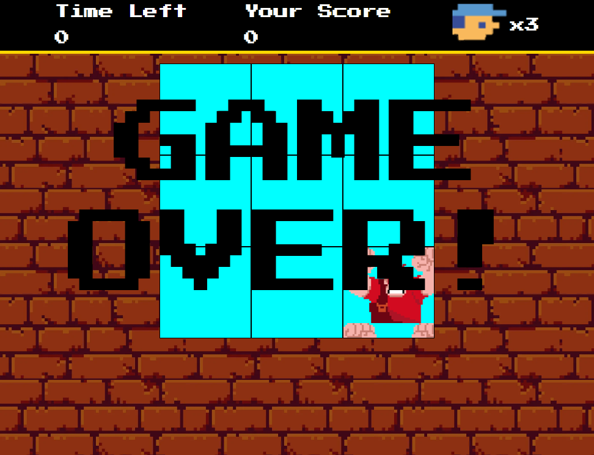

#Detona Ralph Game

Este repositório contém o projeto prático desenvolvido durante o Bootcamp Potencia Tech iFood, oferecido pela Digital Innovation One (DIO). O projeto consiste em um jogo simples chamado "Detona Ralph", onde o jogador tem que acertar cliques em inimigos que aparecem aleatoriamente em nove quadrados durante um período de 60 segundos. Além disso, foi adicionada a função de "Game Over" e a inclusão de efeitos sonoros na tela de fim de jogo.

## Como Jogar
Clone este repositório para a sua máquina local:

~~~javascript
git clone https://github.com/seu-usuario/detona-ralph-game.git
~~~

Abra o arquivo index.html com umservidor local, como liveserver no VS Code.

Inicie o jogo clicando nos inimigos que aparecem nos quadrados.

Você tem 60 segundos para fazer a maior quantidade de pontos possível.

Ao final do tempo, a tela de "Game Over" será exibida, acompanhada de efeitos sonoros.

## Recursos Adicionados
Game Over: Adicionada a função de encerramento do jogo após 60 segundos, mostrando a pontuação final do jogador.

Efeitos Sonoros: Foram incluídos efeitos sonoros na tela de "Game Over" para uma experiência mais imersiva.

## Tecnologias Utilizadas
* HTML5
* CSS3
* JavaScript

## Créditos
Este projeto foi desenvolvido como parte do Bootcamp Potencia Tech iFood, promovido pela Digital Innovation One. Agradeçemos à DIO por fornecer uma excelente oportunidade de aprendizado.

## Contribuições
Contribuições são bem-vindas! Sinta-se à vontade para abrir issues ou pull requests para melhorias, correções de bugs ou novos recursos.

Divirta-se jogando Detona Ralph! 🚀

 
